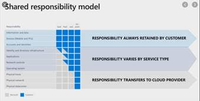
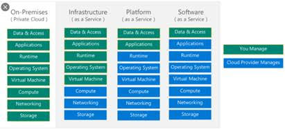
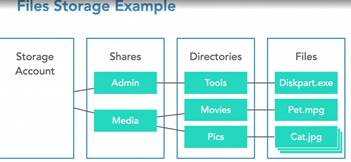
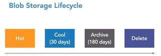

## AZ-900
### Overview of the objectives and keypoints
 
 
 | Key word     | Description |
| ----------- | ----------- |
|Who is this exam for:|The exam is intended for candidates who are just beginning to work with cloud based solutions or are new to Azure.|
|Cloud Advantages|<li> Trade "capital expense" for variable expense <li> benefits from massive economic scale<li>stop guessing capacity<li>stop spending money running and maintaining data centers<li>high availablity, low latency <li> "Go global" in minutes. Global foot print <li> adhere to government regulations|
|Azure & Exam|<li>Azure has 200+ services. Exam expects you to understand 40+ services<li> Azure Reliable, secure and cost effective<li>Exam tests your decision making abilities (which service do you choose in which situation)|
|sections|<li>Describe cloud concepts<li>Describe core Azure services<li>Describe core solutions and management tools on Azure<li>Describe general security and network security features<li>Describe identity, governance, privacy, and compliance features<li>Describe Azure cost management and Service Level Agreements|
  

### Benefits and Considerations of Using Cloud Services

 
 | Key word     | Description |
| ----------- | ----------- |
|High Availability (HA)|<li>Systems are available for long time <li>High availability is a quality of computing infrastructure that allows it to continue functioning, even when some of its components fail. ... Highly available systems guarantee a certain percentage of uptime—for example, a system that has 99.9% uptime will be down only 0.1% of the time—0.365 days or 8.76 hours per year. **What HA is not** – Backup or DR, High performance, Load balancing|
|Scalability|Cloud scalability in cloud computing refers to the ability to increase or decrease IT resources as needed to meet changing demand.One of the great features of Azure service is its ability to auto scale according to the demands of the application usage. ... Basically, increasing or decreasing the resources for application is called scaling. Instance is created each time a web app is deployed <li>Scale up – Increase workload on current resources<li>Scale down – decrease workload on the current resources |
|Elasticity|scaling out - Elasticity is used just to meet the sudden up and down in the workload for a small period of time. Scalability is used to meet the static increase in the workload whereas elasticity is used to meet dynamic changes, where the resources need can increase or decrease. Increase or remove  workload on additional resources.|
|Agility|how quickly the resources respond the changes. Agility is the ability to move quickly and easily in response to change or challenge, but in a business setting, the term really depends on the context. e.g.: Provision or decommission cloud services in matter using self-service|
|DR|The ability to recover from a failure. Disaster recovery is built in. How Azure Site Recovery and Backup Will Help You Build a Reliable Business Continuity and Disaster Recovery (BCDR) Strategy. Among the challenges facing your business is ensuring that your data is safe and recoverable, and that your apps and workloads are running in the event of a planned or unplanned outage.|

 

### Regions and Zones
 

 | Key word     | Description |
| ----------- | ----------- |
|Geographies|<li>Azure is broken down into worldwide geographies, which ensures data residency and compliance boundaries are met. Each geography will contain two or more regions. <li>An Azure geography is a discrete market, typically containing at least two or more regions, that preserves data residency and compliance boundaries. Geographies allow customers with specific data-residency and compliance needs to keep their data and applications close.<li>Customer can select whether data is stored. It doesn’t have to be within their own geography.|
|Regions and region pairs|<li>Azure provides +60 regions around the world (most number of regions around the world)<li>A region is simply a collection of data centers<li>One thing to note is not all services are available in all regions.<li>Each of the regions contains the regional pairs. A regional pair consists of two regions within the same geography.<li>Azure serializes platform updates (planned maintenance) across regional pairs, ensuring that only one region in each pair updates at a time. If an outage affects multiple regions, at least <li>one region in each pair will be prioritized for recovery <li>Some Azure services take further advantage of paired regions to ensure business continuity and to protect against data loss. Azure provides several storage solutions that take advantage of paired regions to ensure data availability.
|Availaibilty zones|Unique physical locations within a region. <li>Each zone is made up of one or more datacenters equipped with independent power, cooling, connectivity and networking.<li>Not all locations have availability zones. <li>There are 3 zones per region.<li> Azs in a region are connected through low-latency links|
|Availibility sets|When you implement availability zones you protect against data center failures. And this is an optional service, you do not have to implement it. Before availability zones we would protect our data using availability sets. Availability sets are still available to us and we still use them. And availability set ensures that our virtual machine is online during maintenance or failure. When you provision a virtual machine to an availability set the virtual machine is assigned to an update domain and a fault domain. The reason the virtual machine is assigned to the update domain is that only one update to main would be updated at a time. Ensuring that your virtual machine is still up and running in another update domain. Assigning the virtual machine to a fault domain provides physical isolation within the data center. That's it for the physical components that make up the Azure Architecture. |
|Fault domains|Group of VMs sharing a common power source and a network switch|
|Update domains|Groupof VMs that are rebooted (updated at the same time)|
 
 

### Azure Virtual Machines
 

 | Key word     | Description |
| ----------- | ----------- |
|what is VM| where do you deploy applications in the cloud? Rent virtual servers <li>Virtual  machines- virtual servers in Azure<li>Azure Virtual machines- Provision and Manage VM (Google-computer engines, EC2 - Elastic cloud)<li>Iaas<li>It is a physical computer that is virtualised<li> (A virtual machine is a computer file, typically called an image, that behaves like an actual computer. In other words, creating a computer within a computer. ... The virtual machine is sandboxed from the rest of the system, meaning that the software inside a virtual machine can't escape or tamper with the computer itself.)<li>Includes an operating system, virtual processor, storage, networking<li>Manged the same as a physical machine. We're still responsible for updating it, backing it up and patching it.|
|VM features|<li>Create and manage life cycle of VM instances <li>Load balancing and auto scaling for multiple VM instances <li> Attach storage to your VM instances <li> Manage network connectivity and configuration for your VM instances|
|Create VM|from Azure portal <li> got to virtual machine <li> add <li> create a resource group <li> name for virtual machine <li> select region, operating system (by choosing an image), size <li> SSH public key, Generate new key pair, key pair name <li> inbound portsHTTP980), SSH(22) <li> review and create<li> download and _save_ private key|
|VM and running commands using cloud shell-bash for linux,( powershell for windows)|<pre>chmod 400 my-first-vm_key.pem ssh -i YOUR_KEY_PATH azureuser@PUBLIC_IP_ADDRESS ssh -i my-first-vm_key.pem azureuser@13.90.35.80  apt-get -y update  apt-get -y install nginx  echo "Hello World" echo "Hello World" > /var/www/html/index.html echo "Hello World from in28minutes" > /var/www/html/index.html  hostname echo "$(hostname)" echo "Hello World from $(hostname)" echo "Hello World from $(hostname)" > /var/www/html/index.html</pre>
|Azure VMs-Key Concepts-image, Size and disks|<li>image-Choose operating system and software<li>VM family Choose the right family of hardware<li>VM size (b1s,B's..) - Choose the right quantity of hardware (2vCPUs, 4GB of memory etc)<li>attach Virtual disks (block storage), configure via VM disk tab |
|Installing nginx on Azure VM|<pre>#!/bin/sh  sudo su apt-get -y update  apt-get -y install nginx  echo "Getting started with Azure Virtual Machines">/var/ww/htnl/index.html  echo "Welcome to Azure $(whoami)">/var/ww/htnl/index.html  echo "Welcome to Azure $(hostname)">/var/ww/htnl/index.html</pre>|
|Cloud Init Script- automate the previous step|when creating a VM, add this scipt to custom data and cloud init section. the script will automatically run<pre>#!/bin/sh  sudo su apt-get -y update apt-get -y install nginx<pre>echo "Welcome to Azure $(hostname)" > /var/www/html/index.html</pre>|
| Increasing Availability for Azure VMs - Availability Sets and Zones|<li>Single instance VM (premium SSD and ultra disk: 99.9%, standard SSD managed Disks: 99.5%, Standard HDD Managed disks: 95%) <li> Create two or more instances in the same avaialbility set - 99.95% <li>Two or more istances in two or more availibilty zones in the same Azure region:99.99% <li> Summary: create multiple instances in multiple AZs if you want high availability|
|VM Scale sets| How do you simplify creation and management of  multiple VMs? VM scale sets<li> allow you to create and manage a group og Azure VMs (HA)<li> add a load balancer (optional)Add a load balancer <li>(optional) Distribute VM instances across Multiple AZs (where avaialble) <li> Supports Manual Scaling and Auto Scaling <li>Supports up to 1000 VM instances in a singlr sales sets|
|Create a VM scale set|<li> search for Virtual machine scale set <li>Add <li> resource group, name, default region, availability zones, image, size, SSH public key (can choose an already exisitng one)<li>network interface - add a public ip as by default it only creates a private ip address <pre> Edit network interface, go to public inbound port -allow selected ports   tick HTTP(80) , SSH(22) - public IP address -> Enabled </pre> <li> Use a load balancer, accept all the defaults <li> scaling options manual/custom <li>Advanced - run cloud init scripts here and specify fault default count <li> "instances" will show the instaces created <li>individul invoke- Open each instances and find the public ip addresses to run <li> run via load balancer - open and find the ip address to run (if you do a curl 'ip address' in bash, it will show how load balancer balance requests between VMs )<li> can increase the number of instances via "scaling"|
|Load balances |Typically have front end and a back end  public ip address is the front end. Requests received to the frontend are routed to the backend. Backend pools are the scale set. |
|public Ip address| are not free. charged per hour. also it can get lost if you restart the machine.|
|static ip address| if you want to keep the same ip address, you can specify a static ip address when you create the VM. <li> public ip -> create new -> assigment static|
|Azure monitoring| Monitoring for your Azure VMs|
|Dedicated Hosts|Physical servers dedicated to one customer- not sharing , go to Martket place and select dedicated host to create. all the VMs created on this host will be guranteed to be belonging to you only|
|Create cheaper, temporary instances for non critical workloads| Create a spot instance <li> tick Azure spot instance option while creating the VM. Azure offers unused space at a cheaper prices. important no availability guarantee. Azure can evct spot Vms with 30 sec notice|
|ReserveD VMs| search for reservations. add. reserving for 1 or 3 years for significal cost discounts|
|Vertical Scaling| increasing hardware from small to large.i.e. deploying application/database to a bigger instance. <li> larger hard drive, a faster CPU, more RAM, CPU,I/O, or networking capabilities etc. <li> Virtual Machines -> settings-> Size <li> there are limits to vertical scaling, also can be very expensive| 
|Horizontal scaling|Delpoying multiple instance of a application/database   Horizontal Scaling is preferred to Vertical Scaling   Horizontal scaling increases availability   BUT Horizontal Scaling needs addtional infrastructure: Scaling Sets, Load Balancers etc.|
|Site recovery|Site Recovery replicates workloads running on physical and virtual machines (VMs) from a primary site to a secondary location. When an outage occurs at your primary site, you fail over to secondary location, and access apps from there.   your virtual machine -> site-> Disaster recovery -> choose tartget region -> replicate|
|Designing good solutuion with VMs|<table><tr><th>Terminology</th><th>Description</th><th>Azure VMs</th></tr><tr><td>Availability</td><td>Are the applications available when your users need them?</td><td>Availabilty Sets and Scale Sets</td></tr><tr>    <td>Scalability</td><td>Can we handle a growth in users, traffic, or data size without any drop in performance?</td><td>VM Size, Scale Sets and   Load balancers</td>  </tr><tr><td>Resilience</td><td>Ability of system to provide acceptable behaviour even when on or more parts of the system fail</td><td>Scale Sets and Load balancers</td></tr><tr><td>Geo-distribution</td><td>Distribute applications across regions and zones</td><td>Scale Sets and Load balancers</td></tr><tr><td>Disaster Recovery</td><td>How to keep your systems running in face of disasters?</td><td>Site Recovery</td></tr><tr><td>Managing Costs</td><td>You want to keep costs low</td><td>Auto scaling Elasticity),  Reservations,  Spot Instances</td></tr><tr><td>Security</td><td>Secure your VMs</td><td>Dedicated Hosts etc..</td></tr></table>|
|VM Scenarios|<table><tr><th>Scenario</th><th>Solution</th></tr><tr><td>How can you automatically scale up and down VMs?</td><td>VM Scale Sets</td></tr><tr><td>How can you protect VMs from datacenter failures?</td><td>Deploy them to multiple AZs (Scale Sets)</td></tr><tr><td>How much availablity do you get by deploying two or more  VM instances in two or more AZs in the same region?</td><td>99.99%</td></tr><tr><td>How can you perform disaster recovery for your VM?</td><td>Site Recovery</td></tr><tr><td>How can you reduce costs for VMs?</td><td>Auto Scaling (Elasticity),  Reserved & Spot Instances,  Right Region -   Cost varies from region to region</td></tr><tr><td>Will you be billed if you stop a VM</td><td>Yes. For Storage.   It is a good practice to delete resources   that aren't required</td></tr><tr><td>Will two VMs of same size always cost the same?</td><td>No. Price changes with time. Price also is different in different regions</td></tr><tr><td>How can you know who performed a specific action on?</td><td>Activity logs (kept for 90 days)   Virtual Machines -> Activity log</td></tr>
</table>| 
|Efficient use of cloud resources|create a resource group for the services and delete the resource group once done|
|Windows Virtual desktop (new to the exam)|All Window Virtual Desktop is, is a Windows 10 desktop that's hosted in Azure.   Windows Virtual Desktop (WVD) is an Azure service that, combined with appropriate licenses, services, and resources, delivers a complete virtualized multi-user            Windows 10 (or a single-user Windows 7) experience together with Office 365 ProPlus.  This allows us to support remote work and a remote workforce. These virtual machines are fully managed and completely scalable. As you add more workers to your  workforce you can easily expand the number of virtual desktops that these users can connect to.|
  

 ### Managed Compute Services
 

 | Key word     | Description |
| ----------- | ----------- |
|The layers of the Cloud|Infrastructure, Platform, Software|
|Services|Infrastructure as a Service (IaaS) Platform as a Service (PaaS)  Software as a Service (SaaS)  Serverless    Backup as a service (BaaS) Database as a service (DaaS) Identity as a service (IDaaS)|
|IAAS|Infrastructure as a service (IaaS) is a cloud computing offering in which a vendor provides users access to computing resources such as servers, storage and networking. Organizations use their own platforms and applications within a service provider's infrastructure. i.e Use only ifrastucture from cloud computer  Only pay for what you use   **Responsibilities:**  Service provider – responsible for the infrastructure. i.e Virtualization, Physical hardware and networking  Customer – Operating systems, configuration and load balancing, Application code and runtime, auto scaling, OS upgrades and patches, backups, availability and so on.  e.g Azure VM|
|PAAS|Cloud platform services, also known as Platform as a Service (PaaS), provide cloud components to certain software while being used mainly for applications. PaaS delivers a framework for developers that they can build upon and use to create customized applications.Prebuilt services provided by the service provider.  **Responsibilities:**   Service provider- is responsible for infrastructure, operating systems (including patches and upgrades),Application Runtime,   management-auto Scaling, Availablity & Load blancing etc.., and backups   Customer-Configuration(of Application and Services), Application code   e.g Azure App service   Databases - Relational & NoSQL (Amazon RDS, Google Cloud SQL, Azure SQL Databases etc   Queues, AI, ML,Operations etc!)|
|(PAAS)Azure App Service|Fully managed platform for building, deploying and scaling your web apps. also supports REST APIs and mobilr back ends.   Natively supports .NET, .NET Core, Node.js, Java Python and PHP|
|(PAAS)Azure App service plan|  Choose App Service Plan: defines a set of compute resources for a web app   **Features:** Automated Deployment and management <li>Auto Scaling<li>Built in Load Balancing |
|(PAAS)Create App service|<li> Search App Services <li> create - create Web App, subscription, unique name, code/docker container, Operating system(linux/windows), app service plan - review and create  open up and running app service, copy URL to access via browser, scale up and out options |
|(PAAS)microservices|trend is to build small focused microservices   Flexibility to innovate and build application in a different programming languages (Go, Java, Python or JavaScript..etc   but deplyment become complex!   Containers provide a way of deploying Go, Java, Python or JavaScript microservices|
|(PAAS)Containers|Create a docker image for each microservice   A Docker image contains application code, libraries, tools, application run time, dependencies and other files needed to make an application run.   VM virtulaizes hardware, while containers virtulaize OS   runs the same way on any infrastructure- your local machine, Corporate data center, Cloud   **Advantages:** <li>Docker containers are light weight (compared to vitual machines as they do not have a Guest OS) <li> Docker provides isolation for containers <l> Docker is cloud neutral|
|(PAAS)Azure container instances (CaaS)|<li> Manage and run simple container based applications <li>**You DO NOT** need to provision and manage VMs <li> Start containers in seconds <li>Azure App service also supports deploying simple containers|
|(PAAS)Create a container instance|search container instances, create, resouce group, unique container name, quickstart images, defaults for image & size, review and create|
|(PAAS)Container Orchestration| Just having a container is not sufficient, it needs orchestration   Typical features: <li> Auto Scaling: Scale containers based on demand <li> Service discovery - help microservices find one another <li>Load balancer- Distribute load among multiple instances of a microservice <li> Self Healing- Do health checks and replace failing instances <li> Zeor downtime deploymewnts- release new versions without downtime   Kubenetes is the most popular   EKS (Elastic Kubenetes Service) -AWS   AKS (Azure Kubenetes service )   GKE (Google Kubenetes Engine)|
|(PAAS)Using a container Orchestrator|1. create a cluster   Deploy & Orchestrate MS|
|(PAAS)AKS and Service Fabric(CaaS)|AKS: Managed Kubenetes service - create Kubenetes cluster, specify Primary node pool, node size, node count, then deploy the application   Azure service Fabric: Microsoft container orchestrator - create service Fabric cluster|
|(PAAS)Serverless|Serverless computing is an architecture where code execution is fully managed by a cloud provider, instead of the traditional method of developing applications and deploying them on servers. It means developers don't have to worry about managing, provisioning and maintaining servers when deploying code.  Serverless computing allows developers to build apps without worrying about the underlying resources, such as virtual machines and networks. The cloud provider is responsible for provisioning, scaling and managing the infrastructure that is required. Apps built on serverless compute can scale dynamically in seconds, and it's a much faster time to market because the infrastructure is already being managed.  **Serverless does NOT mean "No servers". ZERO visibility into infrastructure   Flexiblr scaling and automated high availability   Most Important: Pay for use(pay for requests and NOT servers) ZERO REQUESTS => ZERO COST   e.g Azure functions, AWS Lambdas, Google functions |
|(PAAS)Azure functions (FaaS)|(tied to  App service)Azure Function runs a small piece of code instead of the full blown app. Azure Functions are event, timer, message, or triggered by another event. Basically something will trigger an Azure Function. Typical usage scenarios for Azure Functions include IoT or the processing of data. For example, if someone uploads an image, then the Azure Function would be triggered to process that image.<li> you don't worry about servers or scaling or availability<li> You only worry about your code <li> You pay for what you use - Number of requests, duration of requests, memory consumed <li>Supports C#, Python, JavaScript, Typescript and Java|
|(PAAS)create an Azure functions|Serach for function app, Create Function App, resource group, unique function app name, runtime stack e.g Node.js , create   open resource, add a function, code + test, <li>test/run the template code <li> or get function URL, run via browser |
|(PAAS)Logic Apps|Logic apps automate tasks, processes, et cetera, for integration with other services like apps, data, systems and services. No code is required when we use a logic app. We typically use logic apps to integrate with cloud and or on-premises solutions. <li> Recommended for orchestrating long-running processes and workflows <li> low-code/no-code solutuion <li> Link triggers to action|
|(PAAS)Create a logic app |search for logic apps, add consumption,resource groups, logic app name, default for rest and review and create <li> by default it would take you to logic app designer |
|SAAS|Centrally hosted software (mostly on the cloud).   Offered on a subscription basis (pay-as-you-go)   e.g email, calendering & office tools, CRM, ERP and document management tools   **Responsibilities:**  Service provider- is responsible for </li> OS (incl. upgrades and patches) <li> Application Runtime <li>Auto scaling, Availability & Load balancing etc..<li>Application code and/or, Application configuration (How much memory? How Many instances?..   Customer is responsible for <li> configuring software|
|Shared reponsibility model|   |
|Azure Cloud service catogories- Scenarios|<table><tr><th>Scenario</th><th>Solutuion</th></tr><tr><th>IaaS or PaaS or SaaS: Deploy custome applications in cloud</th><th>IaaS</th></tr><tr><th>IaaS or PaaS or SaaS:Using Gmail</th><th>SaaS</th></tr><tr><th>IaaS or PaaS or SaaS:Using Azure App Service to deploy your app</th><th>PaaS</th></tr><tr><th>True or False: Customer is reponsible for OS updates when using PaaS</th><th>False</th></tr></tr><tr><th>True or False: Customer is reponsible for Availability when using PaaS</th><th>False</th></tr><tr><th>True or False: In PaaS, customer has access to VM instances</th><th>False</th></tr></tr></tr><tr><th>True or False: In PaaS, customer customer can customize OS and install custom software</th><th>False</th></tr><tr><th>True or False: In PaaS, customer customer can configure auto scaling needs</th><th>True</th></tr><tr><th>True or False: In PaaS, customer customer can configure hardware needs (momor, CPU etc) needs</th><th>True</th></tr><tr><th>True or False: PaaS service only offer Compute services</th><th>False  (databases, big data,  IoT, queuing,  machine learning etc.)</th></tr></table>|
 

### Azure Storage
 

 | Key word     | Description |
| ----------- | ----------- |
|Storage types|Block, File, object|
|Block storage|The type of storage on your hard disks. Single block storage can be attached to one VM only. one VM can be attached to multiple block storage|
|file Storage| can be shared between multiple VMs|
|Object storage|Allow upload/download objects using a REST API without mounting them onto your VM|
|Azure Storage|  Azure storage is used to store files, messages and tables.It is massively scalable (upto few PetaBytes), is durable and highly available as well as incredibly secure.|
|Data types|Azure supports 3 types of data <ol><li> Structured data -typical usage of structured data - Has a schema,Rigid format,Relational data,Uses keys to relate a row un one table to a row in another table <li>Semi-structured data - Typical usage: tab delimited files, CSV, XML, and JSON - Adhoc schema, Non-relational format, Known as NoSQl data,Uses tags for data location<li>Unstructured Data- typical usage PDFs, DOCs, JPGs, AVI -No Schema or data Structure|
|Azure Core storage services|There are 5 Storage services available to us in Azure. <li>Azure Blobs - Object store for text and binary data <li>Azure Disk - Block storage (hard disks) for Azure VMs <li> Azure Files- File shares for cloud and on-prem <li>Azure Tables - NoSQL store (This is very basic. Azure Cosmos DB for NoSQL is prefered) <li> Azure Queue - Decouple applications using messaging  (for fundamental exam focus is on Blob, Disk & File)  Azure Storage account is needed for Azure files, Azure Blobs, Azure Queues and Azure Tables|
|Azure Storage   Data redundancy|<table><tr><th>Option</th><th>Redundancy</th></tr><tr><td>Locally redundant  storage (LRS)</td><td>Three synchornous copies in the same data center.   Lease expensive and least availability  **Non critical data**</td></tr><tr><td>Zone-redundant   storage (ZRS)</td><td>Three synchornous copies in the AZs in the primary region. **Higher availablity**</td></tr><tr><td>Geo-redundant   storage (GRS)</td><td>LRS + Asynchornous copy to secondary region(3 more copies using LRS) **in conjunction with backup**</td></tr></tr><tr><td>Geo-zone-redundant   storage (GZRS)</td><td>ZRS + Asynchornous copy to secondary region(3 more copies using LRS) Most expensive and highest available.  **Critical data**</td></tr></table>|
|Azure Disk Storage|Disks for Azure VMs <li>Standard HDD: Recommended for Backup, non-critical, infrequent access <li> Standard SSD: Recommended for Web servers, lightly used enterprise applications and dev/test environments<li> Premium SSD disks: Recommended for production and performace sensitive workloads <li>Ultra disks SSD: Recommendede for IO-intensive workloads such as SAP HANA, top tier databases (for example, SQL, Oracle), and other transaction-heavy workloads    Premium and Ultra provide very high availability|
|Managed vs Unmanaged Disks|<li>Managed Disks are easy to use: Azure handles storage, High fault tolerance and availability <li> Unmanaged Disks are old and tricky (avoid them if you can) - You need to manage storage and storage account, Disks stored in containers (not docker containers)|
|File Storage|Azure Files <li>Media workflows need huge shared  storage for things like video editing <li> Enterprise users need a quick way to share files in a secure & organized way <li> Azure Files are managed file shares <li>Connect from multiple devices concurrently <ul><li>From cloud or on-premises <li>From different OS:Windows, Linux, and macOS</ul><li>Supoorts Server Message Block (SMB) and Network file System (NFS) protocols <li>Usecase: Shared files between multiple VMs (example: configuration files) |
|How to build out Azure file storage |(exactly the way how we build out our file structure on our desktops and laptops.)  Storage account Create shares  Create directories Store files   |
|How to set up Azure Files|1. &nbsp; create storage account- resource group, storage account name, region, performance, redundancy, default for Advanced, default for Networking, default for Data protection, default for tags   2.&nbsp; in the storage account, add a file share-> name-> Qutoa-> Tiers default-> create - once created you can connect to different devices |
|Azure blob storage  **Binary Large Object**t|<li> Objects storage in Azure <li> Structure: Storage Account >Container(s)>Blob(s)<li> Store massive volumes of unstructured data - store all file types   Text, binary, backup & archives<ul><li> Media files and archives, Application packages and logs <li>Backups of your databases or storage devices </ul> There are three types of Blobs <li> Block blobs- Store text or binary as a whole (a new file will replace the old)<li>Append Blobs - Store log files (append operations)<li> Page Blobs-Page blobs are a collection of 512-byte pages, which provide the ability to read/write arbitrary ranges of bytes. Hence, page blobs are ideal for storing index-based and sparse data structures like OS and data disks for Virtual Machines and Databases.|
|Azure Data Lake Storage Gen2|Azure blob storage flat, non hierarchical) enhanced <li>Designed for enterprise big data analytics (exabytes, hierarchical) <li> Low-cost, tiered storage, with high availability/disaster recovery|
|Different kinds of data can be stored in Blob Storage|<li>Media files,website static content <li>Backups of your databases or storage devices<li> Long term archives|
|Variations in access patterns  **Azure blob storage access tiers**|<li>Azure storage offers different access tiers, allowing you to store blob object data in the most cost-effective manner. Available access tiers include:  **Hot** - Optimized for storing data that is accessed frequently.The hot tier has a highest storage costs but the lowest access costs. The hot tier is the default tier when you create a new storage account.  **Cool** - Optimized for storing data that is infrequently accessed and stored for at least 30 dayssuch as short-term backups or data that would still need to be accessed immediately. **Archive** -This is where we store data that is required infrequently such as long-term backups or data that is older than 180 days. Microsoft does recommend that data that is archived must be archived for at least 180 days. If you access that data before the 180 days, you could be charged an additional fee. Archive data is stored offline which means it has a high retrieval latency. It could take several hours or even days to retrieve data from the archive tier but it does offer the lowest storage costs but the highest access cost. We can use these tiers to create a Blob storage lifecycle starting off with our hot data that's accessed all the time. If data hasn't been accessed in let's say 40 days, it gets moved to the cool tier. If that data then hasn't been accessed for six months, it gets moved to the archive tier. If that data hasn't been accessed in a year, then it can be automatically deleted.   To access: Rehydrate(Change access tier to hot or cool)OR copy to another blob with access tier hot or cool.  **Storage tiers can only be configured in Blob storage**   youcan change **access tiers** of an object at any point at time|
|create a blob storage| create a container, upload a file and also change tier can be done, container "properties" URL can be used to upload/download Shared access signature can be used provide restricted access for a specific time frame to Azure container|

  

 ### Azure Databases
 

  | Key word     | Description |
| ----------- | ----------- |
|Core Azure database resources|Databases provide organized and persistent storage for your data   To choose between different databases types, we would need to understand: <li>Availability <li>Durability <li>RTO <li>RPO <li>Consistency<li>Transactions etc..|
|Data Availability|<li>Will I be able to access my data now and when I need it? <li> Percentage of time an application provides the operations expected of it <li> Measurements of availability : <ol>99.5% (22 min downtime/month) four 9's (4 1/2 min downtime/month) - typically aim, 99.99% is considered very good   five 9s (26 seconds downtime/month) - achieving 5 9's of availlability is tough  **Increasing avaialbility :** <li> Have multiple standbys available. ie distribute the database - in multiple zones, in multiple regions|
|Data Durability|Will my data be available after 10 or 100 or 1000 years?  Measurements of durability eleven 9's - 99.999999999 is considered very good (i.e if you store one million files for ten million years, you would expect to loose one file   data durability is more important than availability, It is okay for application to be down for a little bit of time, however once we loose data, it is GONE!  **Increasing durability :** <li> Have multiple copies of data (standbys, snapshots, transaction logs and replicas). ie distribute the database - in multiple zones, in multiple regions |
|RTO and RPO|How do we measure how quickly we can recover from failure ?<li>RPO(Recovery Point Objective): Maximum acceptable period of data loss <li>RTO (Recovery Time Objective): Maximum acceptable downtime   Achieving minimum RTO and RPO is expensive.|
|RTO and RPO failover examples|RPO and RTO are all about trade offs<table><tr><th>Scenario</th><th>Solution</th></tr><tr><td>Very small data loss (RPO- 1min) Very samll downtime (RTO- 5 min)</td><td>**Hot standby**  automatically synchronize data have a standby ready to pick up load use automatic failover from master to standby   distrubute data and have multiple masters</td></tr><tr><td>Very small data loss (RPO- 1min) BUT I can tolerate some downtimes (RTO-15 min)</td><td>**Warm standby** automatically synchronize data have a standby with minimum infrastructure Scale it up when a failure happens</td></tr><tr><td>Data is critical (RPO- 1min) BUT I can tolerate some downtimes (RTO-few hours)</td><td>Create regular data snapshots and transaction logs  Create databases from snapshots and transaction logs when failure happens</td></tr><tr><td>Data can be lost without a problem (for example:cached data)</td><td>Failover to a completely new server</td></tr></table>|
|Types of databases||
|CosmosDB||
|Azure SQL database||
|Azure Database for MySql||
|Azure Database for PostgreSQL||
|SQL Managed Instance||
  

  ### Networking in Azure
 

  | Key word     | Description |
| ----------- | ----------- |
|Core Azure networking resources||
|Virtual Networks||
|VPN gateway||
|Network peering||
|azure ExpressRoute||

  

  ### Exploring Azure Resource Hierarchy
 

  | Key word     | Description |
| ----------- | ----------- |
  

  ### Security and Identity Management
 

  | Key word     | Description |
| ----------- | ----------- |
|Azure security features||
|Azure  security center||
|Azure  key vault||
|Azure Sentinel||
|Azure Dedicated Hosts||
|Azure network security||
|Azure defense in depth model||
|Network security group (NSG)||
|Azure firewall||
|Azure DDos protection (distributed denial of service)||
|Azure identity services||
|Authentication and Authorization||
|Azure active directory||
  

  ### Support and Gurantee - Azure management plans
 

 | Key word     | Description |
| ----------- | ----------- |
| Azure Support Plans     |  Basic(free,scope all), developer($,scop non-prod, email support biz hours), standard($$,scope prod, email & phone support 24/7 ), professional Direct/ProDirect($$$$, scope business critical, email & phone support 24/7)      |
| Available for all plans   |Biling & subsciption management support, submit support tickets, azure advisor, Azure health status and nitifications, 24/7 self help resources (MSDN, stackoverflow)      |
|Available for ProDirect    | Support API(create tickets programmatically), proDirect delivery manager, webinars |
| Reponse time SLA    |developer Sev C:8 hours,Standard Sev C:8 hours, Sev B:4 hours, Sev A:1 hour, ProDirect Sev C:8 hours, Sev B:4 hours, Sev A:1 hour |
| Architecture Support   | developer General Guidance, Standard General Guidance  , ProDirect Guidance from pool of proDirect delivery managers |
| SLA    | SLA is for a particular service. for multiple calculate combined SAL (e.g. 0.99 *0.99 =.98) more services you need => lesser SLA |
|Improve SLA | do not use free tier products, Choose the right product features, deploy to two or more avaliablity zones, deploy components across multiple regions (increase redundancy). add redundancy at all layers|
|Service Life cycle |available in update website. Private preview (no SLA), public preview (no SLA - for experiments), Geberal availability(SLA - recommended for prodution ) private view is not mandatory step of a SLA|
|Azure advisor |Accessible through the Azure portal. It provides best practices for optimization. It will also make recommendations, including cost savings, performance enhancements, high availability, and security options. These recommendations can be saved as a CSV or a PDF file. i.e take immediate actions/schedule, supports notifications for new recommendations, filter recomendations by subscriptions, rsource groups or service, step by step guidance and quick actions for fast remediations, total score, create new advisor aler |
|Azure monitor | It is used to monitor availability and performance of resources using metrics and logs. It will collect application monitoring data, guest OS monitoring data, Azure resource monitoring data, Azure subscription monitoring data and Azure tenant monitoring data.|
|Azure monitor|Gather, analyse and visualise logs and metrics. From azure as well as on prem, monitor resources across multiple subscriptions, proactively identify issues and trigger alerts/automated actions|
Things can be done with AM|Application insights: detect & diagnose applications,VM insights: Monitor performance & health of your VM scale sets, Container insights: mOnitor peeformance of container workloads(AKS, ACI et), Log Analytics: Trouble shoot issues using monitoring data exacted from logs, Create smart alers (SMS, emails etc) and attempt to automatically take corrective action, create visualisations with Azure dashboards, collect data from monitoried resources using Azure Metrics, create alerts |
|Azure Service Health|This is a dashboard that provides insight into Azure and our resources. It will display the current status of Azure, Azure service health, and Azure resource health.You can also view  Health history. personalized alters and guidance for Azure service issues. These are not for your application. Best practice: Set up service health alerts.| 
|Azure service health Hierarchy|Azure Status (global) > Azure service health (customised) > Azure resource health (specific resource). Azure status global view . https://status.azure.com . create alert rule. |
|Scenarios| <ul><li>Get details of upcomming planed outages for services you are making use of -Azure service health</li><li>Get details of services which will be decommisioned - Azure service health</li> <li>Get alerts for new recommendations to improve reliability, security and performance, achieve operational excellence and reduce costs - Azure advisor</li><li>Set up alerts for incidents & planned outages for service you are making use of - Azure Sevice Health </li><li>Set up alerts for issues specific to your resources -VM goes down or Databases goes down or Autoscaling is triggered-Azure monitor</li><li>Solve your application related issues- Azure Monitor(application insights)</li><li>Get suggestions on how to reduce costs of your Azure resources-Azure advisor</li><li>Get suggestions on how to improve reliability of your Azure resources-Azure advisor</li><li>Get suggestions on how to improve security of your Azure resources- Azure advisor</li><li>You want to find out if you are adhering to recommended Azure best practices- Azure advisor </li><li>Track performance of a specific database or a VM instance-Azure monitor </li><li>Gather metrics that are tailored for your applications- Azure Monitor</li></ul>|
|Azure SLA (Service Level Agreement)|"Formal agreement between service provider and the service customer". There are individual sLAs every Azure service. Free services do not have a SLA. |
|Azure modern Lifecycle Policy|Covers products and services that are serviced and supported continuously (applies to most of the services). MS provide minimum 12 months notification priror to ending support. For security updates : 30 days notification is given if an action on customers part is required to prevent significant degradation. If Azure is unable meet the agreement, the customer get service credits.|
|Azure blue prints|helps you create customised standard environments with a set of resource groups, policies, role assignments, and ARM template deployments|
 

### Compliance, Privacy and Governance
 

 | Key word     | Description |
| ----------- | ----------- |
| Azure Policy     |ensure that the resources stay compliant with your policies <ul><li>Create, assign and manage policies - automatically ensure that resources stay compliant with defined standards and SLAs </li><li>Manage compliance of resources across multiple subscriptions</li><li>Assigned to an management group, a single subscription, or a resource group</li></ul> |
|Azure inititives| Group of policies. Azure provides some predefined initiatives. view them under Policy->authoring->definitions|
|Compliance dashboard|Aggregated view of the overall compliance with options to drill down to specific resource/policy|
|Azure policy examples|<ul><li>Only allow creation of VMs of specific sizes</li><li>Only allow creation of resources in a specific region</li><li>Automatically tag all resources in a resource group with the same tags as that of the resource group</li><li>MFA should be mandatory for certain types of accounts </li><li>Exisitng non-compliant resources will be marked as non-compliant, but they will continue to work as is</li><li>policy evaluation is NOT immediate, run once every hour approx</li><ul>|
|Azure Blue prints|Just haveing rules is not suffcient. Azure Blueprint=One or more of (Policy + Role + ARM template + Resource Group) configurations. Azure provides number of pre defined blueprints. Also architecture team can create Blueprints to orginizations standards, patterns, and requirements and the team can use the blueprint to create resources. BP can be assigned to indivdual subscriptions and BPs can be used to set up resource groups within subscriptions|
|why blueprints| Helps teams to quickly set up environemnts adhering to organizational standards. you can even setup an automated CI/CD pipeline. |
|Resource locks|Prevent accidental deletion/modification of resources, applicable at multiple levels: subscription, resource group or resource. Azure resource inherits locks from its resource group and subscriptions.  Locked resources should be unlocked before it can be changed.| two options CanNotDelete (authorized users can read and modify but cannot delete)  and ReadOnly (authorized users can read but cannot delete/update). A resource can have multiple read or delete locks.
|Privacy and Compliance|Microsoft privacy statement, Microsoft product terms site, Data Protection Addendum, Azure Information protection|
|Compliance|Depending on the domain of enterprise, you need to adhere to several industry and security standards (in addition to corporate and ) what standards and regulations does Azure services adhere to? Infomation is in service trust portal- audit documents |
|Azure Compliance Hub|How does Azure hep you with compliance. learn about compliance in Azure in compliance hub. Azure Security and Compliance Blueprints easily create environments with different standards|
|Azure compliance manager|This is part of service trust portal. Automates complete compliance life cycle: Manage risks, Implement Controls, check compliw=ance against regulations and standards, Reporting to auditors|
|Standards to remember|<ul><li>90+ Azure compliance offerings can be grouped into 4 segments: Global, US government, Industry specific and region/country specific </li><li>50+ compliance offerings specific to global regions and countries</li><li>35+ compliance offerings specific to the needs of key industries (health, government, finance)</li><li>International Organization for Standardization (ISO),  ISO:27001 (Security controls),ISO:27017(Security controls for use of cloud services), ISO:27701 (privacy standard), ISO:27018(Privacy on cloud)</li><li>Service organization Compliance(SOC):SOC-1(Auditing standard), SOC-2(Assesment of service provider controls)</li><li>General Data Protection Regulation(GDPR): Strengthens personal data protection in Europe</li><li>Health Insurance Portability & Accountability Act (HIPAA): Data privacy & security requirements for organizations handling personal health information (PHI) (US specific) </li><ul>|
|Compliance Summary|<ul><li>Service TrustPortal &nbsp;&nbsp;&nbsp;&nbsp;&nbsp;Independent audit reports for Microsofts cloud services  <li> Azure Compliance Hub &nbsp;&nbsp;&nbsp;&nbsp;&nbsp; Compliance offerings in Azure  <li>Azure Compliance Manger &nbsp;&nbsp;&nbsp;&nbsp;&nbsp; Mange your organization's compliance requirements part of Service Portal</ul>            |
|Sovereign Regions|<ul><li>Azure global - what we are using until now! shared infrastructure<li>Azure government for only US government)</li><li>Azure China operated by Vianet not Microsoft</li><li>Azure Germany. no longer accepting customers!</li></ul>|
|Azure information protection| flexible service to protect and encrypt document and emails.|
 

 ### Managing Costs
 
 
 | Key word      | Description |
| ----------- | ----------- | 
 |CapEx (Capital expenses) |CapEx is defined as business expenses incurred in order to create long-term benefits in the future, such as purchasing fixed assets like a building or equipment (money spent to BUY infrastructure). Ie. Upfront costs.   e.g deploying your own data center with physical servers, purchasing Zaure Reserved VM instances, lease software  Advantages: predictable fixed costs  Disadvantages: Value decreases over time, waster resource when the project is over, additional cost to maintain infrastructure with time, you might need a tema to manage the infrastructure.     |
 |OpEx (Operational Expenditure|Money spend to USE a service or product. zero upfront costs, Cloud computing shifts IT spending to a pay-as-you-go model, like utility billing; you only pay for what you use, when you use it. For startups or new applications, this well-established argument is sound.  e.g. Provisioning VMs as you need them, using Azure Funtions and paying for invocations. Advantages: test before committing, great for agile environments where demand is unpredictable, ability to delete the resource when the task is done.|
 |Consumption-based Model|you are billed for only what you use. e.g Azure functions - you pay for number of invocations!|
 |Fixed price|you are billed for instances (for its lifetime) irrespective of whether they are used or not. e.g. You provision a VM instance, any App service plan|
 |TCO (Total cost of ownership) calculator| Estimate cost savings you get by migrating your workloads to Azure|
 |Steps of TCO|<ol><li>Define your workloads: Enter the details of your on-premises workloads. servers, databases, storage, networking details</li><li>Adjust assumptions: customize electricity costs, storage costs, IT labour costs, Hardware costs, software costs etc</li><li>view report: side by side comparison of the cost breakdown</li></ol>|
 |Pricing calculator|estimate the costs for Azure services. e.g: VM,storage accounts, Azure SQL database, App service, Azure Cismos DB, AKS. ideal place to explore nd learn important factors about different services. google pricing calculator |
 |Factors that affect cost|<table><tr><th>Factor</th><th>Details</th></tr><tr><td>Resource type and configuration</td><td>How much memory? How much CPU?  Which access tier? </td></tr><tr><td>Usage meters</td><td>How long was your VM running for? How much ingress and How much egress?  How many invocations of an Azure function?</td></tr><tr><td>Azure subscription type</td><td>Free trial vs Pay as you go vs Enterprise Agreement</td></tr><tr><td>Azure Marketplace</td><td>Vendors decide pricing on Azure Marketplace</td></tr><tr><td>Which Region</td><td>Price varies from Region to Region</td></tr><tr><td>Data transfer</td><td><li>Ingress and Egress <li>inbound data from on-prem to Azure is free <li>outbound data from Azure to On-prem is NOT free <li> Data traffic between Azure Services in the same region/AZ is free </td></tr><tr><td>Reserved or not</td><td>some service s offer reservation ahead of time </td></tr></table>|
 |Azure Cost management|<li>Set up and manage your account- configure subscriptions, manage invoices and payment methods. Can create a budget. <li>Analyze and optimize cloud costs- break down and analyze costs for deeper undrstanding of cost and usage patterns <li>Control and optimise costs. set up budget, can give budget a name, set up cost alerts at different thresholds |
 |Cost management best practices|<li> Estimate costs before you deploy IPricing Calculator) <li> Migration cost (TCO) <Li> Create Group resources based on cost ownership- Subscriptions, Resource Groups, attach a cost Tags for each resource you create <li>Use Cost Management feature - cost analysis, Budget and cost alerts, advisor recommendations<li> stop resources when you don't need them (remember you pay all active resources), Use Managed Services PaaS >>> IaaS <li>Reserve VMs for 1 or 3 years|
 

  ### Miscellaneous
 

 | Key word      | Description |
| ----------- | ----------- | 
|Tags| Identify applications, environments or business units that a specific resource is asscociated with. Adding Tags is free.   <li> **Report and track costs** for a group of resources by assigning them witht the same tag <li> **Group resources** based on their SLA, security or compliance requirements   Best Practice: identify mandatory tags that all resources should have and enforce it using Azure policy   <li> e.g. Environement, BusinessUnit, Priority   Tags for Resources are **NOT** inherited by default from their resource group.| 
|Windows virtual desktop|desktops to remote developers.   connect with any device over the internet centralized security with Azure AD   Option to Bring your own licenses (BYOL)|
|Marketplace|when the service is not directly available.<li>Discover, try and deploy the cloud software you want <li> customised and cetified solutions, e2e solutions,solutions for compute, containers, databases, developer tools, devOps<li> e.g Wordpress, RabbitMW, CouchDB etc <li> Flexible hourly billing|

  ### Emerging Architectures
 

 | Key word      | Description |
| ----------- | ----------- |
|IoT devices|hardware with sensors to <li>Capture temperature and humidity levels <li> detect smoke, gas etc <Li> Capture Geo-location and proximity<Li>Capture device metrics etc..   smart watchers, Fitness Trackers, and other wearables, health monitoring, smart homes (lighting, coffee maker, security devices), autonomous and conected vehicles   IoT devices generate huge volumes of time-series data   How do you manage and communicate with millions of IoT devices? use Cloud IoT services  **IoT in the Cloud - typical Steps** <li> 0: Authenticate and Register IoT device <li>1: Capture Data<li>2: Relay Data <li>3: Analyse and get intelligence  **3 important IoT devices**<ol><li>**IoT Hub** -It is the central message hub for bi-directional communications between IoT devices and the application.e.g: between your smartwatch and the application. API access only, no UI<li>**IoT central** -IoT Central is an IoT application platform that reduces the burden and cost of developing, managing, and maintaining enterprise-grade IoT solutions. IoT Hub + Dashboard <li>**An Azure Sphere** MCU (micro controller), along with its operating system and application platform, enables the creation of secured (end-to end  security for IoT devices with device tampering detection), internet-connected devices that can be updated,   controlled, monitored, and maintained remotely. It's comprised of a secured MCU, micro controller,a secured OS, which is Linux-based and a cloud based security service.e.g. ATMs, EPOS devices  </ol><table><tr><th>Azure IoT Hub</th><th>Azure IoT Central</th></tr><tr><td>Pass offering to connect millions of  device securely and at scale</td><td>Saas offering to connect,  manage & monitor devices at scale </td></tr><tr><td>Requires user to create own repository to  define and manage device message templates</td><td>Define & manage device message   templates centrally based on device types</td></tr><tr><td>Device Provisioning service set up required seperately</td><td>Built-in Device Provisioning service</td></tr><tr><td>Provides a built-in event hub endpoint or can make  use of message routing to export data</td><td>Provides data export to Azure  blob storage, event hubs and service bus</td></tr><tr><td>Built-in dashboard not supported</td><td>Built-in dashboards provide a customizable UI   to monitor device health and telemetry</td></tr><tr><td>Message retention - 7 days</td><td>Message retention -30 days </td></tr><tr><td>Supported SDKs to simulate device - C, C#, Java, Node.js, python</td><td>supported SDKs to simulate device - Node.js, python </td></tr></table>|
|Azure big Data|refers to large volumes of data such as weather systems or sales data.There are several analytics tools that we can use to analyse these massive amounts of data|
|Azure Synapse Analytics |Azure Synapse Analytics is a limitless analytics service that brings together data integration, enterprise data warehousing and big data analytics. ... Azure Synapse brings these worlds together with a unified experience to ingest, explore, prepare, manage and serve data for immediate BI and machine learning needs. This service uses enterprise data warehousing and big data analytics together. All of this data can be queried at scale.   Enables MPP (Massively parallel processing)  Run complex queries across petabytes of data (relational, OLAP)   Earlier called Azure SQL Data warehouse|
|Azure HDInsight|Manged open-source analytic service based on Haddop. Azure HDInsight is a cloud distribution of the Hadoop components from the Hortonworks Data Platform (HDP). Azure HDInsight makes it easy, fast, and cost-effective to process massive amounts of data.This is an open source analytics solution. There are several flavours of HDInsight including Apache Hadoop, Apache Spark, Apache Storm and Apache Kafka.Used for comples processing like ETL, data warehousing, machine learning|
|Azure Databricks|Azure Databricks is a managed Apache Spark based analytics platform. Launch Apache Spark envionment in minutes. data analytics platform optimized for the Microsoft Azure cloud services platform. ... For a big data pipeline, the data (raw or structured) is ingested into Azure through Azure Data Factory in batches, or streamed near real-time using Apache Kafka, Event Hub, or IoT Hub. It integrates directly into Azure. This allows collaboration between various users.  build artifical intelligenc(AI) solutuions using Python, Scala, R, Java and SQL. Supports popular data science framework and libraries inclding TensorFlow, PyTorch and scikit-learn. |
|Machine Learning|create a model, use the model <table><tr><th>Service</th><th>Discussion</th></tr><tr><td>**Azure Cognitive Services**</td><td>Pre-built machine learning models   Language Services: Process written text Speech Services: Translation. Text to speech and vice-versa  Vision services: Intelligence around pictures and videos Decision Services: Automatically moderate content. identify anomalies</td></tr><tr><td>**Azure Bot service**</td><td>A bot is a program that you interact with, which feels more human.  Talk with humans like a human Typically, you'll see this type of service when you're on a website and you're trying to get help.   They are virtual agents that enhance customer experience.  The Azure Bot Service allows developers to create these programs that use speech and  understand natural language and answer questions.   Use cases: handling reservations</td></tr><tr><td>**Azure Machine learning**</td><td>Quickly build and deploy models programmatically & visually   supports popular ML languages and frameworks-MLflow, Kubeflow, ONNX,  PyTorch, TensorFlow, Python, R and Jupyter notebooks   Features: Drag-and-drop machine learning & Automated machine learning</td></tr></table>|
|Machine Learning Scenarios|<table><tr><th>Scenario</th><th>Solution</th></tr><tr><th>Virtual agent that talk with humans like a human</th><th>Azure bot service</th></tr><tr><th>Identify objects in a video</th><th>Azure Cognitive Services(Vision Services)</th></tr><tr><th>Automate creation of custom ML models</th><th>Azure machine learning</th></tr><tr><th>Help Dta scientists and AI engineers   create complex ML models</th><th>Azure machine learning</th></tr></table>| |

 ### DevOps
 
 
 | Key word      | Description |
| ----------- | ----------- |
|What is DevOps?|Getting better at @Three Elements of Great Software Teams.  Business,  Development, Operations  Agile brought Buisness and Development together. DevOps brought all three of them together. <li>Communication - Get teams together. <li>Feedback- Earlier you find a problem, easier it is to fix.<li> Automation - Automate testing, infrastructure provisioning, deployment, and monitoring.|
|DevOps-CI,CD|e.g. Code Commit -> Unit Tests ->Integration Tests ->Package ->Deploy ->Automated Tests ->Testing Approval ->Deploy Next  <li> Continuous Integration - continuously run your tests and packaging <li> Continuous Deployment - continuously deploy to test environments <li> Contnuous Delievry - continuously deploy to production|
|Azure DevOps- CI, CD Tools|<li> Azure Repos - private source control (Git)   Alternative: GitHub for private and private source control (recently MS bought GitHub).<li>Azure Pipelines - Orchestrate CI/CD pipelines.   Alterenative: GitHub actions.<li> Azure Boards - Scrum, Agile and Kanban boards <li> Azure Artifacts - Artifact repository to store artifacts <li> Azure test Plans - Automation Test tool to check software quality   integate it into your CI/CD pipelines|
|Infrastructure as Code IAAC|<li>Treat infrastructure the same way as application code <li>* Track your infrastructure changes overtime(version control)<Li> Bring repeatability into your infrastructure <li>Two key parts <ul> <li>**1. Infrastructure Provisioning-** <ul><li> provisioning compute, database, storage and networking. <li>cloud neutral infrastructure provisioning tool - Terraform <li> The recommended Azure service for infrastructure for code - Azure Resource Manager Templates -ARM (can also use Powershell or Azure CLI automation)</ul><li>  **2. Infrastructure Provisioning-**<ul><li>Install right software and tolls on the provisioned resources <li>Open Source Tools - Chef, Puppet, Ansible |
|ARM|Deployment and management service for Azure.  The ways you can create Azure resources.<li> Azure portal <li> Azure powershell - SDKs <li> Azure CLI - SDKs <li> REST clients.  All actions to any resource inAzure go through ARM.|
|ARM Templates|Define resources ina JSON file. <li>Advantages: <ul><li>  Avoid configuration drift <li>  Avoid mistakes with manual configuration <li>Think of it as version control for your environments </ul> <li>Declarative approach to infrastructure code:<ul><li> understands dependencies and creates them in the right order <li> parallelizes creation of resources when possible <li>automatically rollback in case of failures<li>PowerShell and Bash canalso be used for IaaC. But they need step by step instructions. <ul><li>1:Do this <li>2:Do that ...</ul><li>And they don't handle failures very well  |
|Azure portal| Web-based user interface. Great to get started BUT NO automation possible. Runs in all mordern desktop and tablet browsers.|
|Azure Mobile App|iOS and Android Apps (subset of feature). Convenience of managing from anywhere.|
|Azure PowerShell|Execute cmdlets (sequence of commands)and create scripts (PowerShell Scripts). Recommended for teams with Windows administration. However it is cross platform (Windows, Linux and macOS)|Azure CLI|Similar to Azure PowerShell BUT uses Bash scripts. Recommended for teams familiar with Linux administration. However it is cross platform (Windows, Linux and macOS) 
|Azure cloud shell| Free browser based interactive Shell (Access from Azure portal)   Common Azure tools pre-installed and configured to use with your account   Supports both PowerShell and CLI(bash) Runs in all modern desktop and tablet browsers|
|Scenarios|<li>Can you run PowerSgell scripts using Azure CLI - NO <li> Which OS can Azure CLI, PoweShell, Cloud Shell and portal run on? - Windows, Linux and Mac <li>Where can Azure Cloud shell be accessed from?-browser based shell is via portal <li> Tool for one time testing,management, and administrative actions - Azure PowerShell, Azure CLI, Azure portal or Azure mobile apps <li> Repeadedly set up resources across multiple environments - ARM templates|
|Dev test Labs|Quickly provision development and test environments   Build windows and linux environments   Uses ARM templates: can be used to deploy anthing in Azure, compute VMs etc, storage, databases..  Can be integrated into your CI/CD pipelines, set automated shutdowns to minimised the cost
|DevTest Labs Use cases|<li>Quickly test your application with an old version of software or OS <li> Set up a quick load test environment for your app <li> Quickly provision 100VMs for testing specific scenario <li>Quickly provision environments for trainig and demos|
 

  ### Summary-Compute
 

| Azure Service Name     | Description |
| ----------- | ----------- |
|Azure VMs|Windows or Linux VMs(IaaS)   Use VMs when you need control over OS OR you want to run custome software|
|Azure VM scale Sets|Multiple VMs distributed over multiple availability zones, scaling for Azure VMs |
|Azure Load Balancer|Balance load to multiple instances of an application or a service. Typically listed in networking category |
|Azure App service|PaaS. Deploy web apps, mobile backends and RESTtful APIs quickly|
|Azure Container Instances|Also PaaS. Run isolated containers. without orchestration. You DO NOT need to provision and manage VMs. Start containers in seconds|
|Azure Kubenetes Service|Managed Kubenetes Service. Provides container orchestration|
|Azure Service Fabric|Microsoft2s container orchestrator for cloud and on-premises. Package, deploy, and manage scalable and reliable microservices|
|Azure Functions|Serverless compute for event-driven apps|
 

  ### Summary-Networking
   

| Azure Service Name     | Description |
| ----------- | ----------- |
|Azure virtual Network|create your own private network in the cloud|
|Azure Firewall|Stateful firewall to protect resources in your Azure Virtual Network and can be connected to multiple Azure virtual networks. It sits outside you VN |
|Azure DDos Protection|Protect Azure-hosted applications from DDOS attacks|
|Azure ExpressRoute|Dedicated connection from Azure to on-premises. gives you higher band width|
|Azure VPN Gateway|Encrypt traffic betweenvirtual network & on-premises Traffic goes over internet(public)|
|Azure DNS|Manage your DNS records   Map Domain Name to IP Address|
|Azure Content Delivery Network|Cache content on edge servers(POPs) located around the world, minimise latency to global users|
 

   ### Summary-Storage
   
There are 5 Storage services available to us in Azure

   | Azure Service Name     | Description |
| ----------- | ----------- |
|Azure disk storage|Store disks attached to VMs|
|Azure Blob storage|It allows users to store large amounts of unstructured data on Microsoft's data storage platform. In this case, Blob stands for Binary Large Object, which includes objects such as images and multimedia files. <li>We use Blob storage for unstructured data. <li>It is highly scalable <li> Microsoft does recommend Blob storage for most of your Azure scenarios.<li> some of the common usages for Blob storage include streaming audio and video, storing backups, images and documents.(AVI, Docs, JPG)|
|Azure File Storage| Azure Files is a shared storage service that lets you access files via the Server Message Block (SMB) protocol, and mount file shares on Windows, Linux or Mac machines in the Azure cloud. You can also cache file shares in on-premises Windows Servers using the Azure File Sync agent. <li>File storage is our file share in the cloud.<li>We can easily lift and shift our current file shares or shared data into file storage.<li>To access the File share, we can use the Server Message Block protocol or SMB. If you see SMB in storage on the exam, always think of File storage.<li>When we use File storage, we can actually mount those shares to a system providing direct access to the files in the cloud from anywhere at any time. And that system that we've mount the file share to can be a virtual machine, or it could even be your laptop.<li>Azure File storage will support multiple connections|
|Azure queue Storage|Decouple applications using a queue (asynchronous communication)|
|Azure Table storage|Store structure data using NoSQL approach (NON-relational). Schemaless. Key/attribute store. This is not recommended. Recommended NoSQL solution is CosmosDb|
|Azure Geo-redundant Storage (GRS) |replicates data to a secondary region automatically, ensuring that data is durable even in the event that the primary region isn't recoverable. Data resides in the same geography ensuring data compliancy requirements are met.|

   
   

### Summary-Azure database services

   

   | Azure Service Name     | Description |
| ----------- | ----------- |
|Azure Cosmos DB|NoSQL database. Globally distributed|
|Azure SQL Database|Relational database|
|Azure Database for MySQL|Fully managed MySQL database|
|Azure Database for PostgreSQL|Fully managed PostgreSQL database|
|Azure Databse Migration Service|Migrate databases to the cloud|
|Azure Cache for redis|Managed service for Redis|  
   

### Certification Exam
    

   *  Familiarize certification Home Page: https://docs.microsoft.com/en-us/learn/certifications/exams/az-900
   * Practice  questions - different types of questions
        * Type 1: Single answere -2/3/4 options and i right answer
        * Type 2: Multiple Answer - 5 (or more)options and 2(or more)right answers
        * No penalty for wrong answers
        * feel free to guess if you don't know the answer
        * 40-60 questions and 80 minutes 
        * read the entire question - idetify the key part of the question
        * Read all answers at least once
        * if you don2t know the answer, eliminate wrong answers first
        * Mark questions for future consideration and review them before final submission    
   * Re-visit weak areas

   * Result immediately shown after exam compltetion
   * Email with detailed scores (a couple of days later)
   

### Questions

   

   | Question     | Answer |
| ----------- | ----------- |
|TRUE or FALSE: Every Azure Region has at least 3 Availability Zones|False|
|TRUE or FALSE: All Availability Zones in an Azure Region are present in the same data center|False|
|TRUE or FALSE: Availability Zones in a region are connected through low-latency links|True|
|Which of these are advantages of Regions?|High availablility, low latency, global footprint|
|Azure Cache for redis|Managed service for Redis| 
|Which of these help you to attach Virtual Disks to VMs (Block Storage)?|Azure Disks|
|Which of these options does NOT help you to reduce costs for your Azure VMs?|Dedicated Hosts|
|Which of these represents "Ability of system to provide acceptable behavior even when one or more parts of the system fail"?|Resilience|
|TRUE or FALSE: Cost of two VMs with same machine type in two different regions are equal|FALSE|
|Deploying application/database to bigger instance is:|Vertical Scaling|
|TRUE or FALSE: You will NOT be billed for a VM or storage after it is stopped|FALSE|
|You want your virtual machines to survive a data center failure. You are using a Virtual Machine Availability Set to deploy your VMs. Does this always meet your requirement?|No|
|You want your virtual machines to survive a data center failure. You are using a Virtual Machine Scale Set to deploy your VMs. Does this always meet your requirement?|Yes|
|An Azure VM has been manually shutdown. You want to find out who initiated the shutdown. Which of these services would you recommend?|Azure Activity log|
|Which of these Operating Systems are supported by Azure VMs?| Both Linux and Windows|
|Which of these configurations provide 99.99% availability for your VM based deployment?| Multiple VMs in two or more Availability Zones (or regions)
|Office 365 is an example of|SaaS|
|Azure SQL Database is an example of |PaaS|
|Azure Virtual Machine is an example of|IaaS|
|Provisioning Virtual Server with Windows Server 2016 is classified as |IaaS|
|Installing a SQL Server Database Manually in Windows Virtual Machine is classified as|IaaS|
|TRUE or FALSE: Platform as a Service (PaaS) solutions like Azure Web apps or Azure SQL databases provide full control of underlying operating system|FALSE|
|TRUE or FALSE: Platform as a Service (PaaS) solutions like Azure Web Apps provide you with configuration options to scale (manually or automatically) your applications|TRUE|
|TRUE or FALSE: If you are using a Software as a Service (SaaS) services like Office 365, you are responsible for installing the SaaS application.|FALSE|
|If you are using a Software as a Service (SaaS) services like Office 365, which of these is your responsibility?|Configuring SaaS solution |
|Which of these virtualizes Operating System?|Containers|
|You want to run one container quickly. Which of these services would you recommend?|Azure Container Instances|
|You want to implement a microservices architecture using a cross platform  container orchestration solution. Which of these services would you recommend?|Azure Kubenetes Service|
|You don't want to worry about infrastructure and focus on your code. Which of these services would you recommend?|Azure Functions|
|You want to build a serverless workflow with a GUI involving orchestration of  multiple long-running processes.  Which of these services would you recommend?|Azure Logic Apps|
|TRUE or FALSE: Customer is responsible for Availability when using PaaS|FALSE|
|TRUE or FALSE: In PaaS, customer has access to VM instances|FALSE|
|Your application needs customized OS and custom Software installed. Which of these services would you recommend?|Azure VMs|
|TRUE or FALSE: Hot tier is recommended for frequently accessed data in Azure Blob Storage|TRUE|
|TRUE or FALSE: Data stored in Azure Blob Storage - Archive tier can be accessed within minutes|FALSE|
|TRUE or FALSE: Three copies are made of every piece of data you store in Azure Storage|TRUE|
|TRUE or FALSE: Data stored in Azure Blob Storage using Archive tier should be rehydrated before you can access it|TRUE|
|TRUE or FALSE: Data stored in Azure Storage Locally redundant storage (LRS) is replicated across multiple availability zones|FALSE|
|TRUE or FALSE: Data stored in Azure Storage Zone-redundant storage (ZRS) is replicated across multiple availability zones|TRUE|
|TRUE or FALSE: Data stored in Azure Storage Zone-redundant storage (ZRS) is replicated across multiple regions|FALSE|
|TRUE or FALSE: Data stored in Azure Storage Geo-redundant storage (GRS) is replicated across multiple regions|TRUE|
|TRUE or FALSE: Data stored in Azure Blob Storage using archive tier has low storage cost and high retrieval cost|TRUE|
|You have a requirement to keep your files for period of 5 years. These files will be rarely accessed. What storage tier would you recommend?|Archive|
|You have several machines running on-premises with Windows 10. You are planning to map network drive to these machines and you been tasked to choose corresponding Azure Service. Which of these options would you recommend?|Azure File Service|
|Unmanaged Disks are stored as:|Containers in a storage account|
|TRUE or FALSE: Unmanaged Disks are easier to use than Managed Disks|FALSE|
|You are runiing an application in VM instance storing its data on a persistent data storage. You are taking snapshots every 48 hours. If the VM crashes, you can manually bring it back up in 45 minutes from the sanpshot. What is your RTO and RPO?|RTO-45 min  RPO-48 hours|
   

 
 

 

